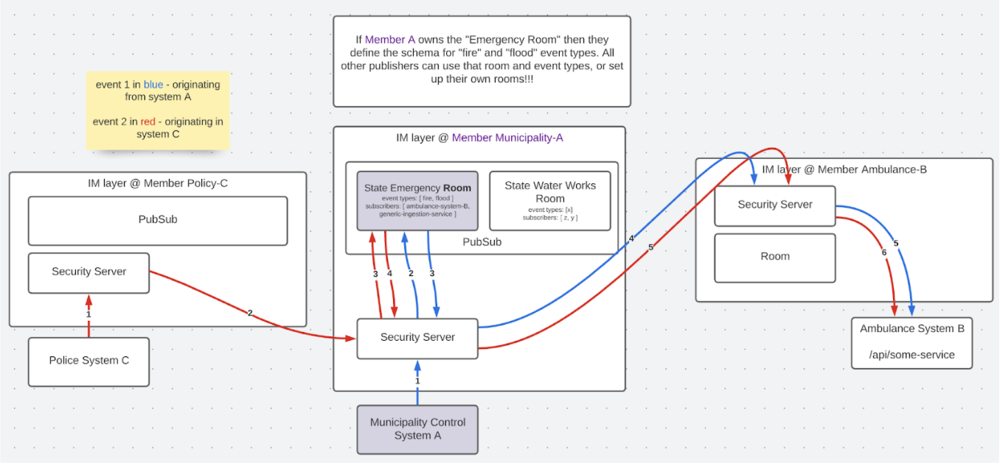

# 7 Requirements Clarification

## 7.1 Understanding Rooms

To understand Rooms, consider the following example: If the "birth" event type is the responsibility of the MoH, then the MoH is responsible for the Room containing the “birth” event type. Also, if MoH is running an instance of a security server on their infrastructure, they are also now running an instance of the Room software (for "birth", "sickness", and "visit" event types) behind that security server. There could be multiple Rooms under a single owner, and each Room might hold multiple event types. This gives the “owner” of an “event type” the authority to decide exactly who is allowed to publish events of that type and who is allowed to subscribe to events of that type.

Note how in the above diagram, “Ambulance-B” is an Information Mediator Building Block “member” that has subscribed its “Ambulance System B” REST service (/api/some-service) to “fire” events in the “State Emergency Room”.
