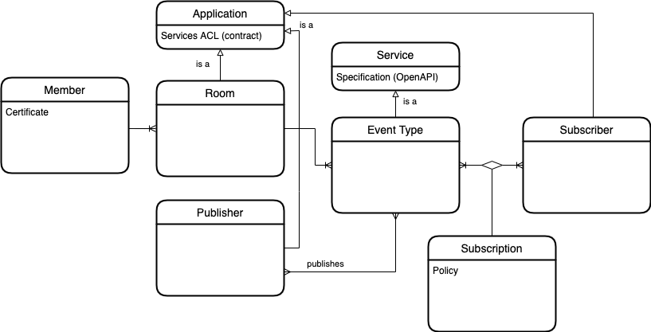

# 7 Data Structures

The resource model shows the relationship between data objects that are used by the Information Mediator Building Block.  The data elements provide detail for the resource model. All data element schemas can be viewed, commented on, and modified in the [schemas section of the Information Mediator Building Block GitHub repository](https://github.com/GovStackWorkingGroup/bb-information-mediator/tree/1.0-QA/schemas).

## 7.1 Resource Model

The Mediator Building Block key element is Service. The Service is used by a consuming Building Block or an application and offered by a provider Building Block or Application. Both Provider and Consumer must be Members of the Mediator Building Block. Members of the Information Mediator Building Block can be an organization (governmental or not, business or not) or a person (citizen as a rule).

To become a Member of Mediator Building Block participants must fulfill declared requirements and apply for onboarding. In the process of onboarding a Member is registered with Mediator Building Block and gets credentials to connect to Mediator Building Block. Normally it is done the way that a Member provides a certificate of recognized Certification Authority (CA), and requests signed with this certificate are considered legitimate requests of the Member. A member entity can access the Pub/Sub configuration and register a room to publish its own event type as a publisher through its own admin.

Members can browse a directory of Services available in the Mediator Building Block. Each service is described in OpenAPI.

## 7.2 Data Elements

### 7.2.1 Member

**Fields:**

| Name         | Type        | Description                                              |
| ------------ | ----------- | -------------------------------------------------------- |
| class        | enumerator  | namespace for member\_code, e.g. GOV or COM              |
| code         | string      | unique id of member in registry defined by member\_class |
| signing\_key | string      | name of key used to sign on behalf of Member             |
| certificate  | certificate | certificate of member issued by trusted CA               |

Schema reference [member.json](../schemas/member.json)

### 7.2.2 Application

**Fields:**

| Name             | Type        | Description                                 |
| ---------------- | ----------- | ------------------------------------------- |
| code             | string      | unique name of application in member scope  |
| connection\_type | string      | protocol used for connection: http or https |
| certificate      | certificate | TLS certificate                             |

Schema reference [application.json](../schemas/application.json)

### 7.2.3 Service

**Fields:**

| Name             | Type   | Description                                    |
| ---------------- | ------ | ---------------------------------------------- |
| code             | string | unique name of OpenAPI in scope of application |
| description\_url | url    | location of OpenAPI service description        |
| service\_url     | url    | service provisioning network address           |
| ACL              | object | description of access rights                   |

Schema reference [service.json](../schemas/service.json)

## **7.3 PubSub Layer**

### 7.3.1 Resource Model

The Resource Model is an extension of the Access Layer model:

### 7.3.2 Data Elements

#### 7.3.2.1 Event

**Description:** An event is a set of data described by event type. Each event has an id. The event corresponds to the message. Data elements of an event are described by event type OpenAPI description.

#### 7.3.2.2 Event type

**Description:** An event type is a service described by OpenAPI. Each event type is owned by a Room of a certain authority. (E.g. the Ministry of Health might own Room with the “new\_birth” event type and define its schema.)

#### 7.3.2.3 Publisher

**Description:** A publisher is a GovStack application that produces events and sends them to Rooms.

#### **7.3.2.4 Room**

**Description:** A room is a GovStack application that handles the distribution of events. Each Room has a set of connected event types (e.g., the “birth” room might contain three event types: “new\_birth”, “birth\_complication”, and “infant\_death”). A room is located in the member’s local Information Mediator Building Block implementation and the member is responsible for all types of events in that particular room.

#### 7.3.2.5 Subscriber

**Description:** A subscriber is a GovStack application that can process events. Subscribers are independent of each other and their business logic differs (as a rule). Each subscriber processes events from their own perspective.

Schema reference [broadcast.json](../schemas/broadcast.json)
